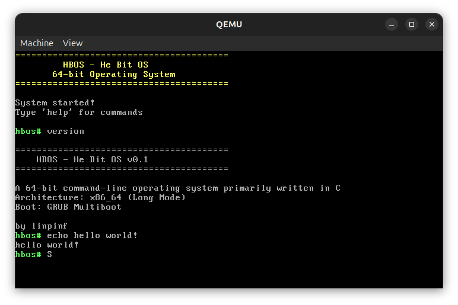

   # HBOS - He Bit OS

> 当前版本：0.1 beta2
> 64-bit 高分辨率图形命令行操作系统，支持多阶段 AI 协同开发



## 0.1 beta2 更新

- ✅ 默认构建产物收敛为 BIOS/UEFI 双 ISO：`build/hbos-bios.iso` 与 `build/hbos-uefi.iso`
- ✅ UEFI 启动链路改进，支持生成面向虚拟机使用的 GPT/ESP 安装盘镜像
- ✅ 新增 HBFS 磁盘文件系统路径，支持从 MBR/GPT 分区挂载
- ✅ POSIX/ramfs 文件工作流完善：`open/read/write/lseek/stat/unlink` 等接口可用于 shell 与用户应用
- ✅ Shell 增加文件、应用、ATA、磁盘管理相关命令
- ✅ 新增启动自测，POSIX/ramfs 通过时输出 `[SELFTEST] POSIX/ramfs: PASS`
- ✅ 新增 ACPI poweroff 路径，`poweroff`/`shutdown` 优先走 ACPI，失败后回退到虚拟机端口
- ✅ 修复 CJK 滚动错位与滚动时光标残影问题

## beta1 更新

- ✅ 内核启动横幅与 `version` 命令显示更新为 `beta1`
- ✅ 支持构建时 TTF → HZK16 点阵字体生成，并内嵌 CJK 字库
- ✅ 支持 UTF-8 中文/CJK 字符输出，应用程序可直接通过控制台 API 输出中文
- ✅ Shell 基础命令拆分到 `src/tools/`，按 System/Debug/History/Help 模块化注册
- ✅ PS/2 键盘支持方向键、Home/End、PgUp/PgDn、小键盘与 NumLock 状态切换
- ✅ 支持 PgUp/PgDn 浏览终端历史上下文
- ✅ 初步加入协作式多任务框架和任务上下文切换

## 功能特性

- ✅ 64 位长模式 (x86_64) — 启动页表覆盖 0-4GB
- ✅ BIOS/Multiboot2 + UEFI 双启动
- ✅ VGA 文本模式 + 高分辨率图形终端 (flanterm) 双输出
- ✅ ANSI→VGA 颜色转换 (VGA 16 色，支持高亮)
- ✅ PS/2 键盘驱动 (Shift/CapsLock/NumLock/方向键/Home/End/PgUp/PgDn/小键盘)
- ✅ 交互式 Help 模式 (类似 Python `help()`)
- ✅ 命令分组管理 (系统/文件/图形/调试/用户)，基础命令已模块化到 `src/tools/`
- ✅ 命令历史 / 搜索 / 上下键回滚 / PgUp-PgDn 上下文浏览
- ✅ UTF-8 中文/CJK 字符显示（构建时 TTF → HZK16 点阵）
- ✅ 初步协作式多任务框架
- ✅ 多阶段 AI 开发文档体系
- ✅ 应用程序 API (硬件抽象层)

## 快速开始

### 依赖
```bash
sudo apt install build-essential nasm grub-pc-bin grub-efi-amd64-bin xorriso mtools dosfstools qemu-system-x86 qemu-utils ovmf python3 python3-pil
```

Windows 推荐使用 WSL 构建。先安装 Ubuntu WSL，然后在 WSL 内安装依赖：

```bash
sudo apt update
sudo apt install build-essential nasm grub-pc-bin grub-efi-amd64-bin xorriso mtools dosfstools qemu-utils python3 python3-pil
```

### 构建与运行
```bash
make           # 构建 BIOS/UEFI 双 ISO
make bios-iso  # 只构建 build/hbos-bios.iso
make uefi-iso  # 只构建 build/hbos-uefi.iso
make release   # 构建发布产物：ISO + VMware VMDK + VirtualBox VDI
make run       # QEMU BIOS 硬盘启动目标
```

Windows PowerShell / CMD 中也可以直接调用：

```powershell
.\scripts\build-windows.ps1 -Clean
```

或：

```cmd
scripts\build-windows.cmd -Clean
```

构建产物仍在：

- `build/hbos-bios.iso`
- `build/hbos-uefi.iso`
- `build/hbos_vmware_uefi.vmdk`（`make release` / `make vmware-uefi`）
- `build/hbos_virtualbox_uefi.vdi`（`make release` / `make vbox-uefi`）

### 虚拟机使用

VMware Workstation/Player 25H2：

- 固件类型选择 `UEFI`
- 关闭 `Secure Boot`
- 光盘启动使用 `build/hbos-uefi.iso`
- 硬盘启动可添加现有磁盘 `build/hbos_vmware_uefi.vmdk`
- 推荐内存 `512 MiB` 或更高

VirtualBox：

- 勾选 `Enable EFI`
- 关闭 Secure Boot 相关选项
- 光盘启动使用 `build/hbos-uefi.iso`
- 硬盘启动可添加现有磁盘 `build/hbos_virtualbox_uefi.vdi`

## 项目结构

```
hbosv2/
├── src/
│   ├── boot.asm              # Multiboot2 引导 + 4GB 页表
│   ├── kernel.c               # 内核入口（极简，仅调用各子系统初始化）
│   ├── graphics/
│   │   ├── graphics.h         # 图形子系统 API
│   │   ├── graphics.c         # flanterm + VGA 回退 + ANSI→VGA 颜色 + CJK 渲染
│   │   ├── font_cjk.c/.h      # CJK 字库查找与 UTF-8 辅助
│   │   └── cjk_glyph.asm      # 内嵌 build/font_cjk.bin
│   ├── shell/
│   │   ├── shell.h            # Shell/命令系统 API
│   │   └── shell.c            # 历史 + 键盘驱动 + 行编辑 + 命令注册
│   ├── tools/                 # Shell 基础命令模块
│   │   ├── help.c             # help 命令
│   │   ├── system.c           # reboot/poweroff/echo/version/clear/credits
│   │   ├── debug.c            # status 等调试命令
│   │   └── history.c          # history/clearhistory/search
│   ├── core/                  # 内核核心框架
│   │   ├── task.c/.h          # 协作式多任务调度
│   │   └── task_switch.asm    # x86_64 上下文切换
│   ├── api/
│   │   └── hal.h              # 硬件抽象层 — 应用程序开发入口
│   ├── fb.c / flanterm.c      # flanterm 高分辨率终端渲染引擎
│   └── fs.c                   # 文件系统框架 (待实现)
├── docs/                      # 8 个子目录的完整 AI 开发文档
├── Makefile                   # 构建系统
└── linker_bios.ld             # 链接脚本
```

## Shell 命令

| 命令 | 分组 | 说明 |
|------|------|------|
| `help` | System | 交互式帮助模式（Python 风格） |
| `help <cmd>` | System | 显示单条命令帮助 |
| `clear` | System | 清屏 |
| `version` | System | 版本信息（0.1 beta2） |
| `echo <text>` | System | 输出文本 |
| `reboot` | System | 重启系统 |
| `poweroff` / `shutdown` | System | 关机 |
| `credits` | System | 致谢 |
| `status` | Debug | 系统状态 |
| `history` | System | 命令历史 |
| `clearhistory` | System | 清除历史 |
| `search <term>` | System | 搜索历史 |

## 应用程序开发 API

### 示例程序

```c
/* myapp.c — HBOS 应用程序示例 */
#include "api/hal.h"

static void my_handler(int argc, char **argv) {
    console_puts("Hello from my app!\n");
    console_set_fg(0x00FF00);
    console_puts("This is green text\n");
    console_set_fg(0xFFFFFF);
}

void app_main(void) {
    app_register_command("myapp", "My first HBOS app", my_handler);
}
```

### API 参考

| 函数 | 类别 | 说明 |
|------|------|------|
| `console_puts(str)` | 控制台 | 输出字符串（自动计算长度） |
| `console_write(str, len)` | 控制台 | 输出指定长度的字符串 |
| `console_putchar(c)` | 控制台 | 输出单字符（自动刷新缓冲区） |
| `console_flush()` | 控制台 | 强制刷新输出缓冲区 |
| `console_clear()` | 控制台 | 清除屏幕 |
| `console_set_fg(color)` | 控制台 | 设置前景色 (24-bit RGB) |
| `console_set_bg(color)` | 控制台 | 设置背景色 (24-bit RGB) |
| `console_get_size(&cols, &rows)` | 控制台 | 获取终端字符尺寸 |
| `console_is_initialized()` | 控制台 | 检查终端是否就绪 |
| `kb_get_key()` | 键盘 | 阻塞式按键读取 |
| `sys_reboot()` | 系统 | 重启系统 |
| `sys_poweroff()` | 系统 | 关闭系统 |
| `sys_udelay(us)` | 系统 | 微秒级忙等延时 |
| `sys_mdelay(ms)` | 系统 | 毫秒级忙等延时 |
| `app_register_command(name, desc, handler)` | 命令 | 注册 Shell 命令 |

### 编译应用程序

```makefile
# 在 Makefile 的 C_SRCS 中添加
C_SRCS += apps/myapp.c
```

## 技术架构

### 启动流程

```
BIOS → GRUB (Multiboot2) → boot.asm (32-bit)
  ├── CPUID 长模式检测
  ├── 4 级页表 (P4 + P3 + 4×P2 = 6 页，4GB 2MB 大页映射)
  ├── PAE → EFER.LME → CR0.PG
  └── LGDT → 64-bit long_mode
      └── call kmain(mbi)
```

### 图形双模式与 CJK 输出

```
console_puts(str)
  ├── ASCII / ANSI → flanterm_write() → 高分辨率帧缓冲
  ├── UTF-8 CJK    → UTF-8 解码 → HZK16 字形查找 → 像素级绘制
  └── VGA fallback → vga_putc_fallback() → ANSI SGR → VGA 颜色属性
```

### 页表布局 (4GB)

| 页表 | 映射 |
|------|------|
| p2_0 | 0GB - 1GB |
| p2_1 | 1GB - 2GB |
| p2_2 | 2GB - 3GB |
| p2_3 | 3GB - 4GB |

## 多阶段计划

| Phase | 名称 | 状态 |
|-------|------|------|
| 0 | 引导系统 | ✅ |
| 1 | 内核核心 | ✅ 初步任务框架 |
| 2 | 图形系统 | ✅ CJK/Framebuffer/VGA |
| 3 | Shell | ✅ 模块化命令/行编辑/历史 |
| 4 | 设备驱动 | ✅ PS/2 键盘；ATA 待完善 |
| 5 | 文件系统 | ⬜ |
| 6 | 内存管理 | ⬜ |
| 7 | 进程管理 | ✅ 协作式多任务雏形 |

## 许可证

GPL-3.0
    ├── Hybrid ISO: 同时包含 BIOS 和 UEFI 部分
    └── EFI ISO: (未来支持) 仅包含 UEFI 部分
```

### VGA 颜色表

| 编号 | 颜色 | 编号 | 颜色 |
|------|------|------|------|
| 0 | 黑 | 8 | 深灰 |
| 1 | 蓝 | 9 | 亮蓝 |
| 2 | 绿 | 10 | 亮绿 |
| 3 | 青 | 11 | 亮青 |
| 4 | 红 | 12 | 亮红 |
| 5 | 紫 | 13 | 亮紫 |
| 6 | 棕 | 14 | 黄 |
| 7 | 浅灰 | 15 | 白 |


## 应用程序开发 API

### 示例程序

```c
/* myapp.c — HBOS 应用程序示例 */
#include "api/hal.h"

static void my_handler(int argc, char **argv) {
    console_puts("Hello from my app!\n");
    console_set_fg(0x00FF00);
    console_puts("This is green text\n");
    console_set_fg(0xFFFFFF);
}

void app_main(void) {
    app_register_command("myapp", "My first HBOS app", my_handler);
}
```

### API 参考

| 函数 | 类别 | 说明 |
|------|------|------|
| `console_puts(str)` | 控制台 | 输出字符串 (自动计算长度) |
| `console_write(str, len)` | 控制台 | 输出指定长度的字符串 |
| `console_putchar(c)` | 控制台 | 输出单字符 (自动刷新缓冲区) |
| `console_flush()` | 控制台 | 强制刷新输出缓冲区 |
| `console_clear()` | 控制台 | 清除屏幕 |
| `console_set_fg(color)` | 控制台 | 设置前景色 (24-bit RGB) |
| `console_set_bg(color)` | 控制台 | 设置背景色 (24-bit RGB) |
| `console_get_size(&cols, &rows)` | 控制台 | 获取终端字符尺寸 |
| `console_is_initialized()` | 控制台 | 检查终端是否就绪 |
| `kb_get_key()` | 键盘 | 阻塞式按键读取 |
| `sys_reboot()` | 系统 | 重启系统 |
| `sys_poweroff()` | 系统 | 关闭系统 |
| `sys_udelay(us)` | 系统 | 微秒级忙等延时 |
| `sys_mdelay(ms)` | 系统 | 毫秒级忙等延时 |
| `app_register_command(name, desc, handler)` | 命令 | 注册 Shell 命令 |

特殊键码：`KB_UP` `KB_DOWN` `KB_LEFT` `KB_RIGHT` `KB_ESC`

## 多阶段开发计划

| Phase | 名称 | 状态 | 说明 |
|-------|------|------|------|
| Phase 0 | 引导系统 (BOOT) | ✅ | Multiboot2, 4GB 页表, 长模式 |
| Phase 1 | 内核核心 (CORE) | ⬜ | GDT/IDT, CPU 检测, 中断 |
| Phase 2 | 图形系统 (GRAPHICS) | ✅ | flanterm + VGA 颜色回退 + CJK 渲染 |
| Phase 3 | Shell 命令系统 (SHELL) | ✅ | 模块化命令, help, 分组, 历史, 行编辑 |
| Phase 4 | 设备驱动 (DRIVERS) | ✅/⬜ | PS/2 键盘已增强，ATA/PCI/串口待完善 |
| Phase 5 | 文件系统 (FILESYSTEM) | ⬜ | 块设备, FAT32, VFS |
| Phase 6 | 内存管理 (MEMORY) | ⬜ | PMM, VMM, Heap |
| Phase 7 | 进程管理 (PROCESS) | ✅/⬜ | 协作式任务调度已加入，Syscall 待实现 |

## 许可证

GPL-3.0 license
