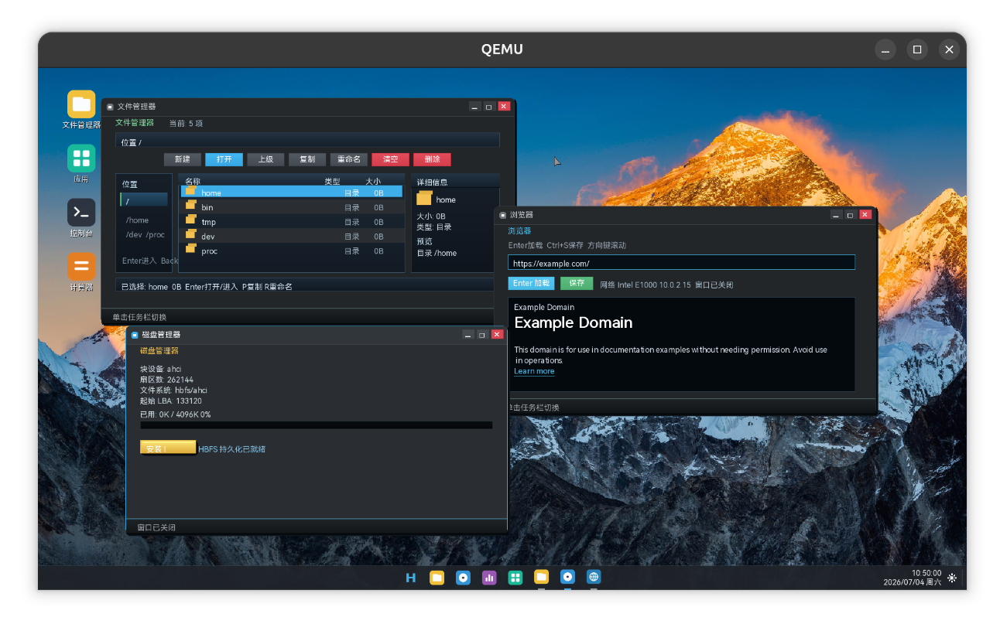

# HBOS

> He Bit OS — 面向 x86_64 的轻量实验操作系统

当前版本：`v0.1-beta5-pre5` · 支持 BIOS / UEFI · 正在积极开发



_截图来自 beta3；beta5 的 HIVE 界面仍在持续迭代。_

HBOS 从引导、内核、驱动、文件系统、网络栈到桌面环境均以“小而可用”为目标。
项目优先照顾低配置设备和清晰的模块边界；构建完成后直接运行在裸机或虚拟机，
不依赖 Linux 或其他宿主操作系统提供运行时。

> [!WARNING]
> HBOS 仍处于早期开发阶段，不适合保存重要数据或用于生产环境。UEFI 启动时
> 需要关闭 Secure Boot；真机支持取决于具体硬件。

## 项目概览

| 领域 | 当前能力 |
|---|---|
| 启动 | x86_64 长模式、Multiboot2 BIOS、UEFI、ISO 与硬盘镜像 |
| 内核 | 物理/虚拟内存、任务调度、系统调用、ELF/HAX 用户程序、动态链接 |
| 终端 | framebuffer/VGA 输出、ANSI 颜色、UTF-8/CJK、Shell 与命令历史 |
| 桌面 | [HIVE](https://github.com/HeBitOS/HIVE) 桌面、窗口管理、合成器、应用启动器 |
| 应用 | TinyCC、BusyBox applets、文件管理器、终端、编辑器、计算器、浏览器等 |
| 存储 | ramfs、FAT32、HBFS、AHCI 优先并回退 ATA PIO |
| 网络 | E1000、DHCP、ARP、ICMP、DNS、TCP、HTTP/HTTPS、用户态 socket API |
| 输入 | PS/2 键鼠、USB xHCI HID 键盘与鼠标基础路径 |

HBOS 也提供不包含桌面和图形应用的 no-GUI 构建，可单独验证内核、Shell、
文件系统、网络和用户态程序。

## 快速开始

### 1. 安装构建依赖

Ubuntu / Debian：

```bash
sudo apt update
sudo apt install build-essential nasm grub-pc-bin grub-efi-amd64-bin \
  xorriso mtools dosfstools qemu-system-x86 qemu-utils ovmf \
  python3 python3-pil
```

Windows 推荐使用 WSL2 + Ubuntu。仓库也提供
`scripts/build-windows.ps1` 和 `scripts/build-windows.cmd` 作为入口。

### 2. 构建

```bash
git clone --recurse-submodules https://github.com/HeBitOS/HBOS.git
cd HBOS
make
```

如果已经使用普通 `git clone` 下载、发现 `limine-bin` 为空，请在 HBOS
仓库目录中执行：

```bash
git submodule update --init --recursive
```

默认生成：

- `build/hbos-bios.iso`
- `build/hbos-uefi.iso`

常用构建目标：

| 命令 | 作用 |
|---|---|
| `make` | 构建 BIOS 与 UEFI ISO |
| `make run` | 在 QEMU 中启动 BIOS 硬盘镜像 |
| `make run-uefi` | 在 QEMU 中启动 UEFI 硬盘镜像 |
| `make release` | 生成 ISO、VMware VMDK 和 VirtualBox VDI |
| `make smoke` | 构建并启动验证全部发布格式 |
| `make nogui` | 构建不含 HIVE 和内嵌应用的 BIOS/UEFI ISO |
| `make run-nogui` | 构建并在 QEMU 中启动 no-GUI BIOS 版 |
| `make run-nogui-uefi` | 构建并在 QEMU 中启动 no-GUI UEFI 版 |
| `make nogui-smoke` | 验证 no-GUI 的组件边界与启动 |
| `make core-only` | 构建 HIVE-capable 核心，但不打包应用 |
| `make hive-test` | 运行 HIVE 控件与事件测试 |
| `make chromium-baseline` | 检查 Chromium 兼容层阶段基线 |

运行 `make help` 可以查看完整目标列表。

### 3. 启动

QEMU 可直接使用上面的 `make run` / `make run-uefi`。虚拟机建议至少分配
`512 MiB` 内存：

- VMware BIOS：挂载 `build/hbos-bios.iso`
- VMware UEFI：关闭 Secure Boot，挂载 `build/hbos-uefi.iso`
- VirtualBox BIOS：关闭 EFI，挂载 `build/hbos-bios.iso`
- VirtualBox UEFI：启用 EFI、关闭 Secure Boot，挂载 `build/hbos-uefi.iso`

进入系统后可先运行：

```text
drivers
status
hive
```

`drivers` 用于确认输入设备、USB、块设备、文件系统和网卡是否被识别；
`hive` 启动图形桌面，`gui` 与 `startx` 保留为兼容别名。

## HIVE 桌面环境

[HIVE（HBOS Interface & Visual Environment）](https://github.com/HeBitOS/HIVE)
是 HBOS 的独立桌面项目，并以 `HIVE/` Git 子模块固定在 HBOS 仓库中。它包含
窗口管理器、合成器、桌面 Shell、用户态控件库和应用 SDK；HIVE 内部还递归
包含必需的 HPT 子模块。

当前 HIVE Toolkit API 1.3 提供：

- Label、Button、Textbox、Checkbox、List、Progress、Slider、Scrollbar、
  Menu、Image、Canvas、Panel；
- 行布局、网格布局、控件树与窗口尺寸变化后的重新排布；
- 鼠标悬停、按下、拖动、松开和窗口外释放捕获；
- Tab 焦点、Enter/Space、方向键、Home/End、PageUp/PageDown；
- 集中式主题配置、文本选区和 UTF-8 安全编辑。

HBOS 暂时保留 HIVE runtime 的集成副本，以确保完整版本和 no-GUI 版本都能
持续构建。拆仓边界与迁移顺序见
[`docs/REPOSITORY_SPLIT_BOUNDARIES.md`](docs/REPOSITORY_SPLIT_BOUNDARIES.md)。
使用 `git clone --recurse-submodules` 会同时取得 HIVE、HPT 和其他依赖。
`make hive-sync` 默认同步仓库内的 `HIVE/`；若需要操作其他 HIVE 工作副本，
可显式传入 `HIVE_REPO=/path/to/HIVE`。

## 应用开发

HAX（HBOS Application eXecutable）是 HBOS 的用户应用格式。应用本质上是带
`.haxmeta` 元数据的 ELF64 用户态程序，可作为 TUI、GUI 或两者兼容的应用。

最小 TUI 应用：

```c
#include <hax.h>

HAX_APP("myapp", "My HBOS application", HAX_KIND_TUI);

int main(int argc, char **argv) {
    (void)argc;
    (void)argv;
    hax_println("Hello, HBOS!");
    return 0;
}
```

把源码保存到 `app/myapp.c` 后运行 `make`，构建系统会自动生成并打包
`myapp.hax`。这只是开发示例，不作为系统预装应用。应用也可以放在独立仓库：

```bash
make APP_DIR=/path/to/apps hax-apps
```

图形应用优先包含 `<hive.h>`，只依赖公开的 HAX/HIVE SDK，不直接访问
framebuffer、窗口管理器或桌面私有状态。

完整开发资料：

- [HBOS HAX 应用开发手册（PDF）](HBOS_HAX_API.pdf)
- [HAX API HTML 源文档](docs/HBOS_HAX_API.html)
- [HIVE 桌面与控件 API](docs/HIVE_DESKTOP_API.md)

## 模块化构建

HBOS、HIVE 与应用遵循以下依赖方向：

```text
应用 → HAX / HIVE SDK
HIVE → HBOS Kernel UAPI / gui_service
HBOS Core → 不依赖具体 GUI 或应用
```

| 变体 | 命令 | HIVE | 内嵌应用 |
|---|---|---:|---:|
| 完整系统 | `make` | 是 | 是 |
| no-GUI | `make nogui` | 否 | 否 |
| GUI 核心 | `make core-only` | 是 | 否 |
| 外部应用 | `make APP_DIR=/path/to/apps hax-apps` | 仅 SDK | 单独产物 |

构建开关包括 `HBOS_ENABLE_GUI=0|1`、`HBOS_BUNDLE_APPS=0|1`、
`APP_DIR=/path` 和 `BUILD_DIR=/path`。

## 硬件支持

| 硬件 | 状态 | 说明 |
|---|---:|---|
| x86_64 CPU | 可用 | 需要长模式 |
| BIOS / UEFI | 可用 | UEFI 不支持 Secure Boot |
| PS/2 键盘、鼠标 | 可用 | 建议真机优先测试 |
| USB xHCI HID | 基础可用 | 键盘、鼠标兼容性仍在扩展 |
| AHCI SATA | 可用 | 优先块设备后端 |
| ATA PIO | 可用 | AHCI 不可用时回退 |
| Intel E1000 | 可用 | 当前主要网络路径 |
| RTL8139 | 可用 | 轮询收发、DHCP/协议栈已接通 |
| VirtIO-net | 仅检测 | 数据收发尚未实现 |
| AC97 | 基础可用 | 依设备和虚拟机配置而定 |

发现真机问题时，请附上 `drivers`、`status` 和串口日志，并注明 CPU、主板、
存储控制器、网卡及启动方式。

## 仓库结构

```text
HBOS/
├── app/                HAX 应用与公开 SDK 头文件
├── docs/               API、模块边界与兼容性文档
├── scripts/            构建、启动和 smoke test 脚本
├── src/
│   ├── api/            内核与可选组件的公开契约
│   ├── core/           任务、内存和中断核心
│   ├── crypto/         TLS 使用的密码学实现
│   ├── graphics/       终端、字体与 GUI 图形资源
│   ├── gui/            HIVE runtime 集成副本
│   ├── input/          键盘与鼠标输入
│   ├── shell/          Shell 和命令注册
│   ├── tools/          系统、文件、网络和图形命令
│   └── user/           用户态运行时、libc 和程序加载
├── third_party/        移植的第三方组件
├── Makefile            构建入口
└── version.mk          版本号来源
```

## 文档与路线图

| 文档 | 内容 |
|---|---|
| [`docs/README.md`](docs/README.md) | 文档索引与 PDF 生成方式 |
| [`docs/HIVE_DESKTOP_API.md`](docs/HIVE_DESKTOP_API.md) | HIVE 控件、事件和应用迁移 |
| [`docs/REPOSITORY_SPLIT_BOUNDARIES.md`](docs/REPOSITORY_SPLIT_BOUNDARIES.md) | 内核、GUI、应用拆仓边界 |
| [`docs/CHROMIUM_COMPAT_BASELINE.md`](docs/CHROMIUM_COMPAT_BASELINE.md) | Chromium 兼容工作的阶段 1 基线 |
| [`CHROMIUM_COMPAT_ROADMAP.md`](CHROMIUM_COMPAT_ROADMAP.md) | Chromium 平台兼容层十阶段计划 |

Chromium 目前尚未移植；路线图描述的是兼容层建设计划，而不是已经可运行的
Chromium 浏览器。

## 当前限制

- 项目 ABI、文件格式和桌面接口仍可能在 beta 阶段变化。
- 真机驱动覆盖有限，QEMU E1000 + AHCI 是最稳定的验证组合。
- 自研网络栈和浏览器仍以基础兼容性为主，不能替代成熟浏览器。
- HIVE runtime 正从内核链接代码迁移为独立用户态服务。
- 不提供 Secure Boot、权限隔离和生产级安全保证。

## 版本简史

- `beta5 pre5`：HIVE 1.1、no-GUI 构建边界、浏览器/TLS 兼容性和模块化路线。
- `beta4`：新桌面、TinyCC、动态链接、BusyBox、网络栈和真机输入修复。
- `beta3`：桌面交互、任务栏、日历、字体、终端刷新与虚拟机启动改进。
- `beta2`：BIOS/UEFI 双 ISO、文件工作流、HBFS、系统自测与磁盘工具。
- `beta1`：CJK 输出、模块化 Shell、PS/2 输入和早期任务框架。

## License

HBOS 使用 [GNU General Public License v3.0](LICENSE) 发布。
